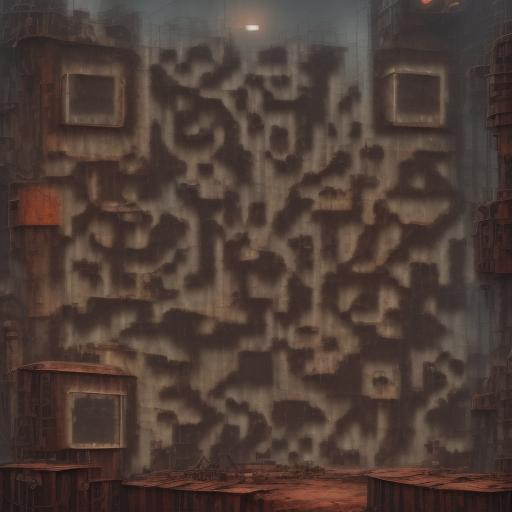

# stable-fast-qr-demo
A demo of using [stable-fast](https://github.com/chengzeyi/stable-fast) to generate qr codes



## Prebuilt Docker Image

```
saladtechnologies/stable-fast-qr-demo:latest
```

## Docs

Swagger docs are available at `/docs` when the application is running.

## Build

```bash
./scripts/build
```

## Run

```bash
docker compose up
```

## Use

Navigate to `http://localhost:1234/` to use the basic UI

```bash
curl  -X POST \
  'http://localhost:1234/generate' \
  -H 'Content-Type: application/json' \
  --data '{
  "url": "https://github.com/SaladTechnologies/stable-fast-qr-demo",
  "params": {
    "prompt": "futuristic robot factory, gritty, realistic, rust, industrial",
    "guidance_scale": 3.5,
    "controlnet_conditioning_scale": 1.8,
    "control_guidance_start": 0.0,
    "control_guidance_end": 0.9,
    "num_inference_steps": 15
  },
  "qr_params": {
    "error_correction": "M",
    "drawer": "RoundedModule",
    "color_mask": "SolidFill",
    "color_mask_params": {
      "front_color": [0,0,0],
      "back_color": [127,127,127]
    }
  }
}' > qr.jpg
```

## Configure

This application is configured with environment variables.

| Variable | Description | Default |
| --- | --- | --- |
| `PORT` | The port to listen on | `1234` |
| `HOST` | The host to listen on | `*` |
| `MODEL_DIR` | The directory to store models in | `/models` |
| `CIVITAI_CONTROLNET_MODEL` | A model version ID for a controlnet on Civit.ai | `122143` |
| `CIVITAI_CHECKPOINT_MODEL` | A model version ID for a checkpoint on Civit.ai | `128713` |
| `IMAGE_SIZE` | The size of the image to generate. This value is locked after start due to `enable_cuda_graph = True` | `512` |
| `HF_SAFETY_CHECKER` | The hugging face model ID of the safety checker to load. | `CompVis/stable-diffusion-safety-checker` |
| `HF_FEATURE_EXTRACTOR` | The hugging face model ID of the feature extractor to load. | `openai/clip-vit-base-patch32` |